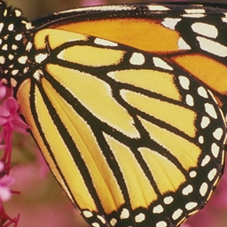
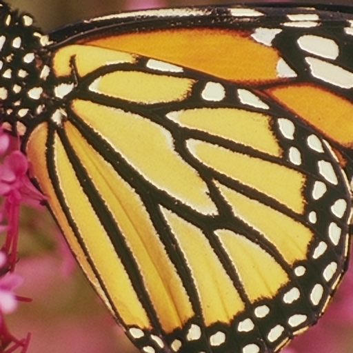
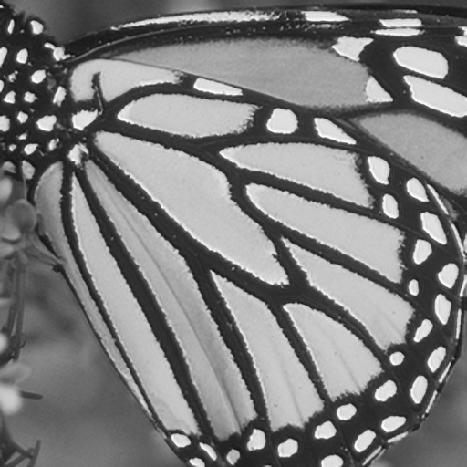

# libsrcnn
### Super-Resolution imaging with Convolutional Neural Network
A stand-alone library for Super-Resolution, Non-OpenCV model related in these projects:
* https://github.com/rageworx/SRCNN_OpenCV_GCC
* https://github.com/shuwang127/SRCNN_Cpp.

## Introduction
This is an open source project from original of this:
**SRCNN_Cpp** is a C++ Implementation of Image Super-Resolution using SRCNN which is proposed by Chao Dong in 2014.
 - If you want to find the details of SRCNN algorithm, please read the paper:  

   Chao Dong, Chen Change Loy, Kaiming He, Xiaoou Tang. Learning a Deep Convolutional Network for Image Super-Resolution, in Proceedings of European Conference on Computer Vision (ECCV), 2014
 - If you want to download the training code(caffe) or test code(Matlab) for SRCNN, please open your browse and visit http://mmlab.ie.cuhk.edu.hk/projects/SRCNN.html for more details.
 - And thank you very much for Chao's work in SRCNN.

## Additional references
* Fast resizing methods for BiCubic filtering 
    * [Free Image Project](http://freeimage.sourceforge.net/)
	* [librawprocessor](https://github.com/rageworx/librawprocessor)
    * [fl_imgtk](https://github.com/rageworx/fl_imgtk)

 
## Features
* Faster about 400% or more than OpenCV GCC version of SRCNN, with OpenMP.
    - references :
    - commit/b340b885a58605f793aa000eebc7f96c19c8e9fe#commitcomment-103507343
	- commit/b340b885a58605f793aa000eebc7f96c19c8e9fe#commitcomment-103507802
* None-OpenCV, no OpenCV required !
* Compilation availed for almost of POSIX g++.
* Simply optimized for basic OpenMP.
* Works well even without OpenMP like macOS.
* Not support M$VC, sorry MS guyz.

## Sample images
* Original 100%

    

* Bicubic 150%

    

* SRCNN 150%

    

* SRCNN (Convolution Y channel) 150%

    

## Supporting platforms
* Windows 32, 64 with MSYS2 + MinGW-W64
* Almost any Linux, x86_32, x86_64, arm, armhf, aarch64
* macOS ( clang, llvm )

## Latest Changes

### Verison 0.1.10.40
* Better speed, less memory usage by convolution I+II
* Regards to zvezdochiot@github

## Previous Changes

### Verison 0.1.9.35
* Fixed memory bug in float images from RGB case.
* header version flag fixed.

### Verison 0.1.9.34
* Fixed don't use color space scaling with bicubic filter.
* Now supporting alpha channel.

### Verison 0.1.8.30
* Precision step scaling bug fixed.
### Verison 0.1.8.28
* Precision step scaling option availed.
* included option by reason of libsrcnn trained for maximum double multiply.
### Verison 0.1.6.23
* Fixed a small bug of wrong internal copying size.
### Verison 0.1.6.22
* Fixed bug of original source (ShuWang's SRCNN).
   - Use last layer (3) to Y channel at last construction.
* Changed ProcessSRCNN() method to get optional convolutional result.
### Verison 0.1.6.20
* Fixed memory leak after convolution55.
* Changed ProcessSRCNN() method to get convolutional gray.
### Version 0.1.4.17
* Bug fixed for color space conversion.
### Verison 0.1.5.18
* Supports variable filters for interpolation.
    1. Nearest
    1. Bilinear
    1. Bicubic
    1. Lanczos-3
    1. B-Spline

## License
* Follows original source GPLv2, but this project is LGPLv3.

## Requirements
* Your G++.

## How to build ?
* build with ```make -f Makefile.{your platform}```.

## Dependency
* [FLTK-custom](https://github.com/rageworx/fltk-custom) and [fl_imgtk](https://github.com/rageworx/fl_imgtk) for build test program for read and write image files.
